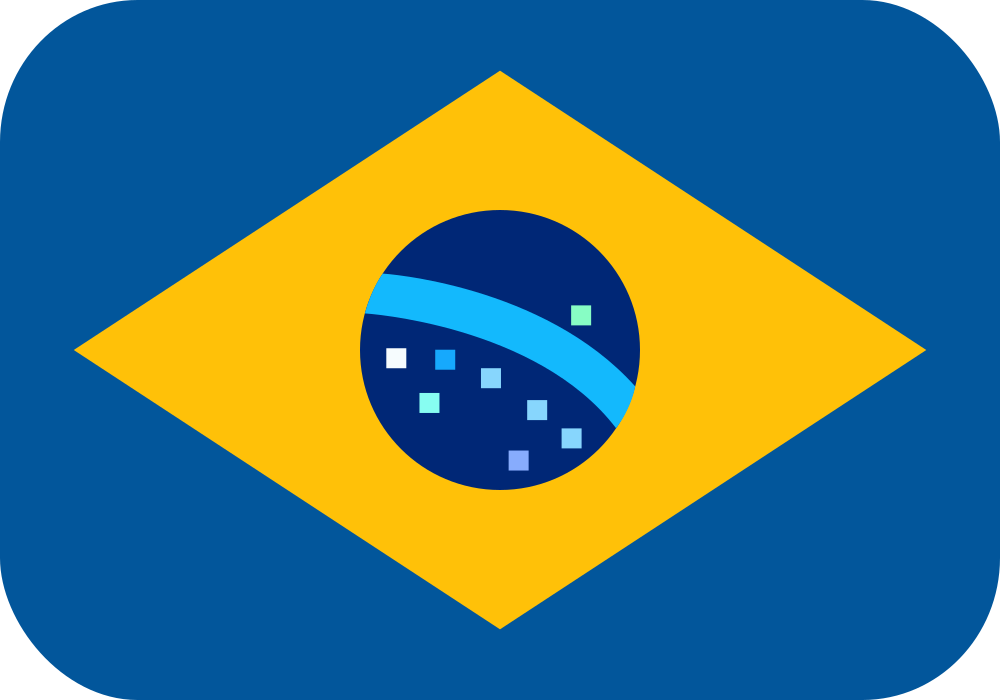

# brasil_fields

O jeito mais fácil de utilizar padrões e formatos brasileiros em seu projeto Dart. 

[**Testar agora**](https://flutterbootcamp.github.io/brasil_fields/#/)

## Apresentação

Este package facilita o desenvolvimento de projetos que utilizam campos com os padrões e formatos brasileiros.

### Instalação

```yaml
dependencies:
  brasil_fields: 1.4.4
```

### Formatters

- Altura (2,22)
- Cartão bancário (0000 1111 2222 3333 4444)
- Centavos (R\$) (7,19) (até 3 casas decimais: 7,191)
- CEP (99.999-999)
- CNPJ (99.999.999/9999-99)
- CPF (999.999.99-99)
- Cpf ou Cnpj (se adapta conforme os números são inseridos)
- Data (01/01/1900)
- Hora (23:59)
- KM (999.999)
- Peso (111,1)
- Placa de veículo (AAA-1234)
- Real (R\$) (20.550)
- Telefone ( (99) 9999-9999)
- Validade de cartão bancário (12/24)

### Padrões

- Estados
- Meses
- Regiões
- Semana


### Como utilizar

Basta incluir o formatter que você quer que o campo tenha, na lista de `inputFormatters` :

**Para garantir que o campo aceite apenas valores numéricos, utilize em conjunto com o formatter `FilteringTextInputFormatter.digitsOnly` .**

```dart
TextFormField(
  inputFormatters: [
    // obrigatório
    FilteringTextInputFormatter.digitsOnly,
    CepInputFormatter(),
  ],
);
```

- `AlturaInputFormatter()`
- `CartaoBancarioInputFormatter()`
- `CentavosInputFormatter()`
- `CepInputFormatter()`
- `CnpjInputFormatter()`
- `CpfInputFormatter()`
- `CpfOuCnpjFormatter()`
- `DataInputFormatter()`
- `HoraInputFormatter()`
- `KmInputFormatter()`
- `PesoInputFormatter()`
- `PlacaVeiculoInputFormatter()` (**atenção**: nao utilizar `FilteringTextInputFormatter.digitsOnly`)
- `RealInputFormatter()`
- `TelefoneInputFormatter()`
- `ValidadeCartaoInputFormatter()`

Caso precise de um DropdownButton com algumas das classes de padrões:

```dart
DropdownButton<String>(
  hint: Text('Região'),
  onChanged: (regiaoSelecionada) {
    print(regiaoSelecionada);
  },
  items: Regioes.listaRegioes.map((String regiao) {
    return DropdownMenuItem(
      value: regiao,
      child: Text(regiao),
    );
  }).toList(),
)
```

### Métodos úteis

A classe `UtilData` possui métodos que facilitam obter o valor de um objeto `DateTime` em formato `String` (e no padrão brasileiro).

- `UtilData.obterDataDDMMAAAA` (DD/MM/AAAA)
- `UtilData.obterDataMMAAAA` (MM/AAAA)
- `UtilData.obterDataDDMM` (DD/MM)
- `UtilData.obterHoraHHMMSS` (hh:mm:ss)
- `UtilData.obterHoraHHMM` (hh:mm)
- `UtilData.obterMes`
- `UtilData.obterDia`

A classe `UtilBrasilFields` possui métodos que facilitam obter os valores CEP, CPF e CPNJ já formatados:

- `UtilBrasilFields.obterCpf('11122233344')` (111.222.333-44)
- `UtilBrasilFields.obterCnpj('11222333444455')` (11.222.333/4444-55)
- `UtilBrasilFields.obterCep('11222333')` (11.222-333)
- `UtilBrasilFields.obterCep('11222333', ponto: false)` (11222-333)
- `UtilBrasilFields.obterTelefone('00999998877')` ((00) 99999-8877)
- `UtilBrasilFields.obterTelefone('(00) 99999-8877', mascara: false)` (00999998877)
- `UtilBrasilFields.obterTelefone('999998877', ddd: false)` (99999-8877)
- `UtilBrasilFields.obterTelefone('99999-8877', ddd: false, mascara: false)` (999998877)
- `UtilBrasilFields.obterDDD('00999998877')` (00)
- `UtilBrasilFields.obterReal(85437107.04)` (R$ 85.437.107,04)
- `UtilBrasilFields.obterReal(85437107.04, moeda: false)` (85.437.107,04)
- `UtilBrasilFields.obterReal(85437107.04, moeda: false, decimal: 0)` (85.437.107)
- `UtilBrasilFields.removeCaracteres` (remove caracteres especiais)
- `UtilBrasilFields.removerSimboloMoeda` (remove o R$)
- `UtilBrasilFields.converterMoedaParaDouble` (remove o R$ e retorna um double)
- `UtilBrasilFields.obterReal` (R$ 50.000,00 ou 50.000,00)

A classe `UtilBrasilFields` possui métodos para validar CPF e CNPJ: `isCPFValido` e `isCNPJValido`.

Para inicializar um `TextEditingController` com o texto já formatado, basta escolher o método com o formato desejado e setar no atributo `text`:

```dart
  final dataController = TextEditingController(text: UtilData.obterDataDDMMAAAA(DateTime(2020, 12, 31)));
  final cnpjController = TextEditingController(text: UtilBrasilFields.obterCnpj('11222333444455'));
```
